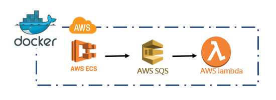

# Localstack Sample

### 透過Localstack 與 ecs-cli 進行實際環境模擬。



## 環境需求 

docker-desktop : Windows 10 64-bit: Home or Pro 2004 (build 19041) or higher, or Enterprise or Education 1909 (build 18363) or higher.

docker-desktop : Enable the WSL 2 feature on Windows. For detailed instructions, refer to the [Microsoft documentation](https://docs.microsoft.com/en-us/windows/wsl/install-win10).

### 先決條件 :

需安裝指令集 [Dotnet6 runtime](https://dotnet.microsoft.com/en-us/download/dotnet/6.0)

需安裝指令集 [AWS CLI V2](https://docs.aws.amazon.com/cli/latest/userguide/getting-started-install.html)

  

### 執行手順

##### 1. 先以Administrator 權限執行 install-cli.ps ， 下載所需指令。


##### 2.接下來關注Taskfile.yaml 

> ``` yaml 
>vars:
> ARTIFACT_PATH: ./artifact/lambda.zip
> SQS_URL: http://localhost:4566/000000000000/sqs
>   
>   tasks:
> init : 
>  desc : 建立全域的 docker network，跨compose 使用
>    cmds :
>          - docker network create local-network
>      localstack :
>     desc:  建立本地工作站 (localstack)
>     cmds :
>       - docker-compose up -d localstack  
>   package_lambda :
>     desc : 發行lambda 函式 (.net6)
>     cmds :
>       - dotnet lambda package -pl ./lambda_sample -o {{.ARTIFACT_PATH}}
> 
>   package_ecs :
>       desc : 發行WEB API (.net6)
>     cmds : 
>       - docker build -t ecs_sample:latest ./ecs_sample
> 
>   lambda :
>       deps: [ package_lambda ]
>     desc: 在工作站 (localstack) 中，啟動lambda
>     vars:
>       FUNCTION_NAME: sqs-dotnet-function
>       FUNCTION_ENTRY : lambda_sample::lambda_sample.Function::FunctionHandler
>     cmds :
>       - AWS_PAGER=""  awslocal lambda delete-function 
>         --function-name {{.FUNCTION_NAME}}
>       - AWS_PAGER=""  awslocal lambda create-function 
>         --function-name {{.FUNCTION_NAME}}
>         --zip-file fileb://{{.ARTIFACT_PATH}}
>         --handler {{.FUNCTION_ENTRY}}
>         --runtime dotnet6 
>         --role arn:aws:iam::000000000000:role/{{.ARTIFACT_PATH}}
>       - AWS_PAGER=""  awslocal lambda create-event-source-mapping 
>         --function-name  {{.FUNCTION_NAME}}
>         --event-source-arn arn:aws:sqs:us-east-1:000000000000:sqs
> 
>   sqs : 
>     desc : 在工作站 (localstack) 中，啟動SQS
>     vars :
>       QUEUE_NAME : sqs
>     cmds : 
>      - awslocal sqs delete-queue --queue-url  {{.SQS_URL}}
>      - awslocal sqs create-queue --queue-name {{.QUEUE_NAME}}
> 
>   put-sqs :
>     desc : 對本地端的 SQS 推送訊息
>     cmds :
>      - awslocal sqs send-message --queue-url {{.SQS_URL}} --message-body "PUSH TO MESSAGE ." 
> 
>   tail-log :  
>      desc : 追蹤 lambda log 
>     cmds : 
>      - awslocal logs tail /aws/lambda/sqs-dotnet-function --follow 
> 
>   ecs : 
>     deps: [package_ecs]
>     desc : 透過 ecs-cli 啟動 web api
>     cmds : 
>      - ecs-cli local up


##### 執行手順如下 :

1.`task init`  : 主要是預先建立 external network 

2.`task localstack` : 將localstack container 啟動，並且注意到   `environment`  相關設定

​    <span style="color:red">`SERVICE`</span>  : 揭露sqs , lambda , cloudwatch log 服務，也代表透過 aws cli 可以針對 localhost:4566 進行操作 。(詳見 ./docker-compose.yml)

​    <span style="color:red">`LAMBDA_EXECUTOR`</span> : 將打包好的zip發行檔，搭配 `LAMBDA_CONTAINER_REGISTRY` 所宣告的 dockerimage 進行部屬。

​    <span style="color:red">`HOSTNAME_EXTERNAL`</span> :  對相同network網域內的其他container 所採用的alias名稱;如 http://<localhost>:4566/sqs ...。

3.`task lambda `: 透過指令，在localstack 建立lambda ，其中依賴了 task :  package_lambda ，這邊會先去建置lambda 。

4.`task ecs` : 透過指令，在localstack 建立 lambda ，其中依賴了 task : package_ecs ，這邊會去建置ecs，部屬內容 。(詳見 ./docker-compose.ecs-local.yml)


##### 驗證手順如下 :

1.`task tail-log` : 追蹤lambda 發出的 log ，如果sqs 有推送訊息就會寫入。

2.呼叫 API  <span style="color:red">`curl -X PUT  localhost:1566/api/SQS` </span>


  


  
